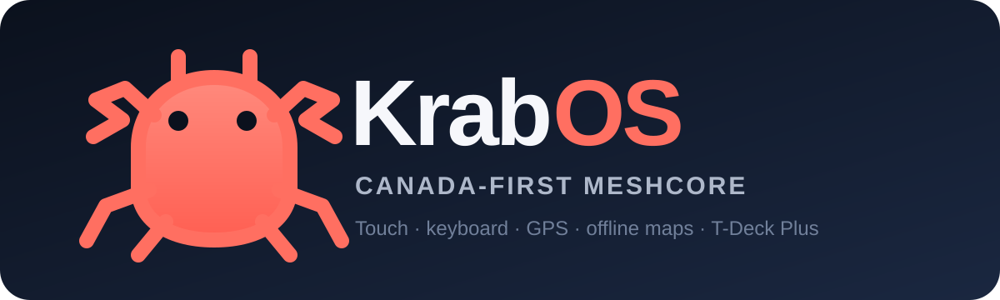
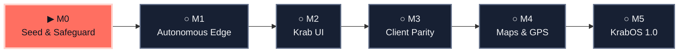

<p align="center">
  
</p>

<p align="center">
  <a href="https://github.com/n30nex/KrabDeck/actions"></a>
  <a href="https://github.com/n30nex/KrabDeck/releases"></a>
  <a href="LICENSE"></a>
  
</p>

# KrabDeck / KrabOS

**KrabDeck** is the source, tooling, and autonomous release system for
**KrabOS**: a Canada-first, touch-first MeshCore client for the LILYGO
T-Deck Plus. It brings messaging, network tools, GPS, and offline SD-card
maps into one small handheld interface.

> [!WARNING]
> KrabOS is under active development. It targets the **LILYGO T-Deck Plus
> only**. Do not flash its binaries to a T-Deck Pro, Seeed Indicator, generic
> ESP32-S3, or any board not explicitly named by a release manifest.

## What it does

- Keeps direct messages, channels, rooms, contacts, repeaters, routing,
  telemetry, and administrative tools on the device.
- Makes touch the shortest path while preserving complete keyboard and
  trackball navigation.
- Defaults to the current Canadian MeshCore profile: 910.525 MHz, SF7,
  62.5 kHz bandwidth, CR 4/5, and 20 dBm. This is a project default, not a
  regulatory certification.
- Renders offline Web-Mercator PNG tiles from
  `/tiles/<z>/<x>/<y>.png` on a FAT32 SD card and supports permitted NRCan
  and configurable XYZ sources.
- Uses the onboard GPS for position, time, tracks, map centring, and boot
  adverts.
- Releases only the exact firmware that passed native, flash, recovery,
  UI, storage, GPS, and RF gates on the dedicated T-Deck Plus fixture.

## Roadmap

Symbols are part of the status so the diagram remains understandable without
colour: **✓ Complete**, **▶ Active**, **○ Planned**, **! Blocked**.



<!-- roadmap-status:start -->
| Phase | Status | Exit gate | GitHub |
|---|---|---|---|
| M0 | ▶ Active | Exact-device backup and unattended RF-off recovery pass without touching either neighbouring ESP32. | [Milestone](https://github.com/n30nex/KrabDeck/milestone/1) · [Issue #1](https://github.com/n30nex/KrabDeck/issues/1) |
| M1 | ○ Planned | A trusted `main` push builds, flashes, verifies, tests, rolls back on injected failure, and publishes a signed edge release. | [Milestone](https://github.com/n30nex/KrabDeck/milestone/2) · [Issue #2](https://github.com/n30nex/KrabDeck/issues/2) |
| M2 | ○ Planned | Every retained feature is reachable by touch, keyboard, and trackball with clean visual evidence. | [Milestone](https://github.com/n30nex/KrabDeck/milestone/3) · [Issue #3](https://github.com/n30nex/KrabDeck/issues/3) |
| M3 | ○ Planned | Safe client parity, one boot advert, and correlated bot DM/channel delivery pass without Public chat traffic. | [Milestone](https://github.com/n30nex/KrabDeck/milestone/4) · [Issue #4](https://github.com/n30nex/KrabDeck/issues/4) |
| M4 | ○ Planned | SD maps survive interruption and reboot, secrets stay private, and simulated plus live GPS gates pass. | [Milestone](https://github.com/n30nex/KrabDeck/milestone/5) · [Issue #5](https://github.com/n30nex/KrabDeck/issues/5) |
| M5 | ○ Planned | Exact-SHA regression, recovery, accessibility, licensing, and extended soak gates automatically publish `v1.0.0`. | [Milestone](https://github.com/n30nex/KrabDeck/milestone/6) · [Issue #6](https://github.com/n30nex/KrabDeck/issues/6) |
<!-- roadmap-status:end -->

The detailed gates and update rules live in [ROADMAP.md](ROADMAP.md). Roadmap
status changes only in the same commit that carries machine-verifiable gate
evidence; issue counts alone never advance a phase.

## Releases and installation

Verified images will appear under [GitHub Releases](https://github.com/n30nex/KrabDeck/releases).
Each release includes a merged flash image, OTA/app image, RF-off recovery
image, web-flasher manifest and segments, ELF, checksums, SBOM/licence bundle,
provenance, and a redacted hardware receipt.

Until an edge release is present, there is no supported binary to install.
The autonomous flasher refuses aliases and binds to one recorded device
identity; it cannot be pointed at an arbitrary serial port.

## Build from source

```bash
git clone --recurse-submodules https://github.com/n30nex/KrabDeck.git
cd KrabDeck
python -m venv .venv
python -m pip install -r ci/requirements-platformio.txt
python scripts/check_roadmap.py
pio test -e native_test
pio run -e KrabOS_TDeckPlus
```

Development and hardware validation are documented in
[CONTRIBUTING.md](CONTRIBUTING.md), [docs/HARDWARE_TESTING.md](docs/HARDWARE_TESTING.md),
and [docs/RELEASE_EVIDENCE.md](docs/RELEASE_EVIDENCE.md). Private Wi-Fi,
location, identity, flash-backup, and SD-card evidence never belongs in Git or
public release artifacts.

## Origins and licence

KrabOS is derived from
[SigurdOS T-Deck](https://github.com/hermes-gadget/SigurdOS-tdeck) at pinned
base commit `300a22d1594e9633c41b5007f741991ebc1bb642` and uses the pinned
[MeshCore](https://github.com/meshcore-dev/MeshCore) protocol library. See
[NOTICE.md](NOTICE.md) for attribution.

KrabOS is free software under
[GPL-3.0-or-later](LICENSE), with third-party components under their respective
compatible licences. It comes with **no warranty**.
